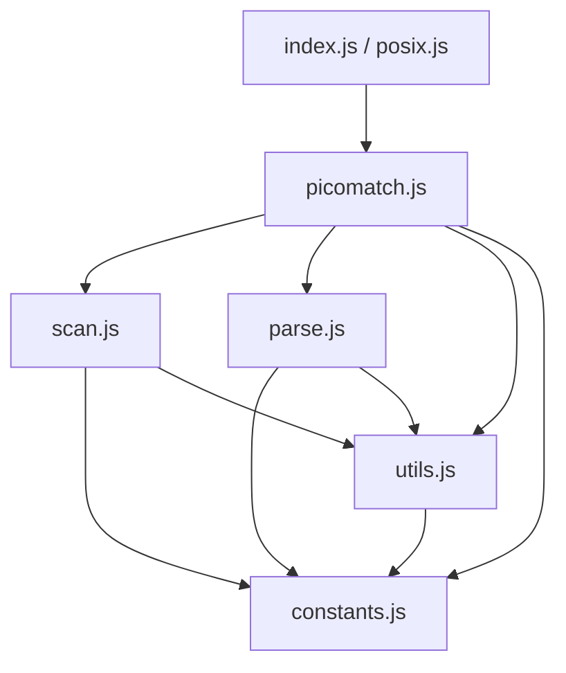
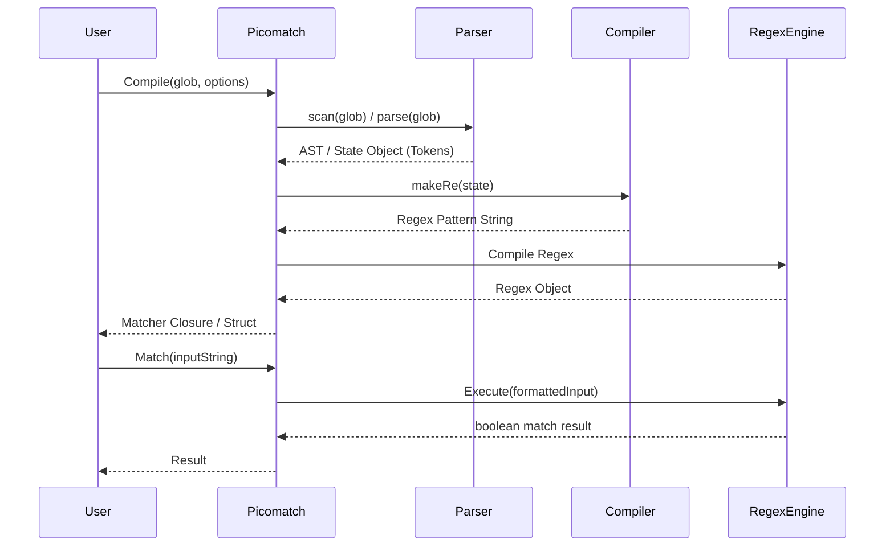

# Picomatch Migration Blueprint (JS to Go)

This document provides a comprehensive blueprint for porting the `picomatch` library from JavaScript to Go.

## 1. Dependency Graph

**Original picomatch dependencies:**
*   **Runtime:** `None` (Zero-dependency package)
*   **Development:** `eslint`, `fill-range`, `gulp-format-md`, `mocha`, `nyc`

**Target Go dependencies:**
*   **Runtime:** `None` (or `github.com/dlclark/regexp2` if RE2 limitations apply—see *Risk Analysis*)
*   **Testing:** Go standard library `testing`, potentially `github.com/stretchr/testify` for assertions.

## 2. Module Graph

The internal architecture of picomatch is highly modular. The translation to Go will closely follow this dependency flow:

## 3. Execution Flow

The core lifecycle of a picomatch evaluation consists of two phases: **Compilation** and **Execution**.

## 4. Public API Inventory

The original API exposes several methods attached to the main exported function. In Go, these will be converted to package-level functions and struct methods.

| JavaScript API | Proposed Go Signature |
| :--- | :--- |
| `picomatch(glob, options)` | `Compile(glob string, opts *Options) (*Matcher, error)` |
| `picomatch.test(input, regex, options)` | `(m *Matcher) Test(input string) TestResult` |
| `picomatch.matchBase(input, glob, options)` | `MatchBase(input string, glob string, opts *Options) bool` |
| `picomatch.isMatch(str, patterns, options)` | `IsMatch(str string, patterns []string, opts *Options) bool` |
| `picomatch.parse(pattern, options)` | `Parse(pattern string, opts *Options) (*ParseState, error)` |
| `picomatch.scan(input, options)` | `Scan(pattern string, opts *Options) ScanResult` |
| `picomatch.makeRe(glob, options)` | `MakeRe(pattern string, opts *Options) (*regexp.RegExp, error)` |
| `picomatch.compileRe(state, options)` | `CompileRe(state *ParseState, opts *Options) *regexp.RegExp` |

## 5. Internal Helper Inventory (`utils.js`)

Helpers that must be ported to the Go `utils` subpackage or internal functions:

*   `isObject(val)` -> *N/A in Go (use typed structs)*
*   `hasRegexChars(str)` -> `HasRegexChars(s string) bool`
*   `isRegexChar(str)` -> `IsRegexChar(r rune) bool`
*   `escapeRegex(str)` -> `EscapeRegex(s string) string` (or `regexp.QuoteMeta`)
*   `toPosixSlashes(str)` -> `ToPosixSlashes(s string) string`
*   `isWindows()` -> `IsWindows() bool` (using `runtime.GOOS`)
*   `removeBackslashes(str)` -> `RemoveBackslashes(s string) string`
*   `escapeLast(input, char, lastIdx)` -> `EscapeLast(input string, char rune, lastIdx int) string`
*   `removePrefix(input, state)` -> `RemovePrefix(input string, state *ParseState) string`
*   `wrapOutput(input, state, options)` -> `WrapOutput(input string, state *ParseState, opts *Options) string`
*   `basename(path, options)` -> `filepath.Base` (with careful handling for cross-platform backslashes)

## 6. Parser State Machine (`parse.js`)

The parser works as a linear state machine traversing the glob string. 
*   **State:** It maintains depth counters for `brackets`, `parens`, `quotes`, and `braces`.
*   **Tokens:** It tracks previous tokens to merge text strings and optimize regex generation.
*   **Extglobs:** It detects `*(...)`, `+(...)`, etc., recursive extglob loops, and applies ReDoS mitigations (replacing risky overlapping branches with character classes).
*   **Go Porting Note:** The state machine heavily mutates strings and arrays. Pre-allocating `strings.Builder` and slice capacities will be critical for Go performance.

## 7. Scanner State Machine (`scan.js`)

The scanner acts as a fast-pass structural analyzer.
*   It operates in a single `while (index < length)` loop without creating complex ASTs.
*   **Objective:** Identify the static `base` directory, the dynamic `glob`, and boolean properties (`isBrace`, `isBracket`, `isExtglob`, `isGlobstar`).
*   **Go Porting Note:** This can be implemented efficiently in Go using string indexing. Be extremely careful to traverse using byte indices vs rune indices appropriately, as standard ascii tokens (`*`, `{`, `(`, `/`) are 1 byte.

## 8. Risk Analysis

| Risk Area | Severity | Description & Mitigation |
| :--- | :---: | :--- |
| **Regex Lookarounds** | **CRITICAL** | JS uses `(?=...)` (lookaheads) and `(?!...)` (negative lookaheads) extensively (e.g., `(?!\\.)`, `(?!(?:^\\|[\\\\/]))`). Standard Go `regexp` is based on RE2 and **does not support lookarounds**.   **Mitigation:** You must either refactor the generated regex to not use lookarounds (extremely difficult for negated globs), or use the `github.com/dlclark/regexp2` package (PCRE port for Go). |
| **String Encodings** | Medium | JS strings are UTF-16, Go is UTF-8.   **Mitigation:** When translating character indices, ranges, and lengths, ensure strict use of `rune` arrays where unicode matching is permitted, or explicitly document byte-level scanning for ASCII. |
| **Dynamic Option Types** | Low | Options in JS are heavily duck-typed (`options.windows = null \|\| undefined`).   **Mitigation:** Create a robust `picomatch.Options` struct with default constructors (`NewOptions()`). |

## 9. Recommended Migration Order

1.  **Constants & Types (`constants.go`, `options.go`)**: Setup standard regex constants, limits, and the Option configuration structs.
2.  **Utilities (`utils.go`)**: Port string replacements, path slashes, and regex escape handlers.
3.  **Scanner (`scan.go`)**: Implement the structural single-pass scanner. It has few external dependencies and validates core string traversal.
4.  **Parser Core (`parse.go`)**: Implement tokenization, extglob ReDoS checks, and AST construction.
5.  **Regex Compiler (`compiler.go`)**: Translate AST states into Regex Source. Decide on RE2 vs PCRE dependencies here based on the lookaround challenge.
6.  **Public API (`picomatch.go`)**: Wire everything together, implement the `Matcher` struct and user-facing wrappers.

## 10. Testing Strategy

*   **Test Suite Porting:** Port all `mocha` tests from the `test/` directory. Given the vast amount of edge-case strings, convert JS test fixtures into a massive JSON array (e.g., `testdata/fixtures.json` containing `[{"glob": "*", "str": "a.js", "opts": {}, "expected": true}]`).
*   **Table-Driven Tests:** Load the JSON via `encoding/json` and run standard Go table-driven tests. This prevents human error in translating thousands of assertions manually.

## 11. Differential Fuzzing Strategy

To guarantee absolute parity with the JavaScript implementation:
1.  Write a simple Node script `adapter.js` that takes `JSON.stringify({ glob, str, options })` from `stdin`, runs the original `picomatch`, and returns boolean to `stdout`.
2.  In Go, use the `testing.F` framework to generate pseudo-random glob patterns, strings, and Option structs.
3.  For each fuzzed input, run the Go implementation. 
4.  Pipe the exact same input to the Node `adapter.js`. 
5.  **Assert `Go Result == JS Result`.** Fail the fuzz run if there is a divergence.

## 12. Benchmark Strategy

*   Create `BenchmarkCompile` and `BenchmarkMatch` in Go using `testing.B`.
*   Establish a baseline using Go's standard library `filepath.Match`.
*   Test against other popular Go globbing libraries (e.g., `github.com/bmatcuk/doublestar`, `github.com/gobwas/glob`).
*   Metrics to track: `ns/op` and `B/op` (allocations are critical). The goal is to minimize heap allocations during matching, leaning on `regexp` pool optimizations if necessary.
