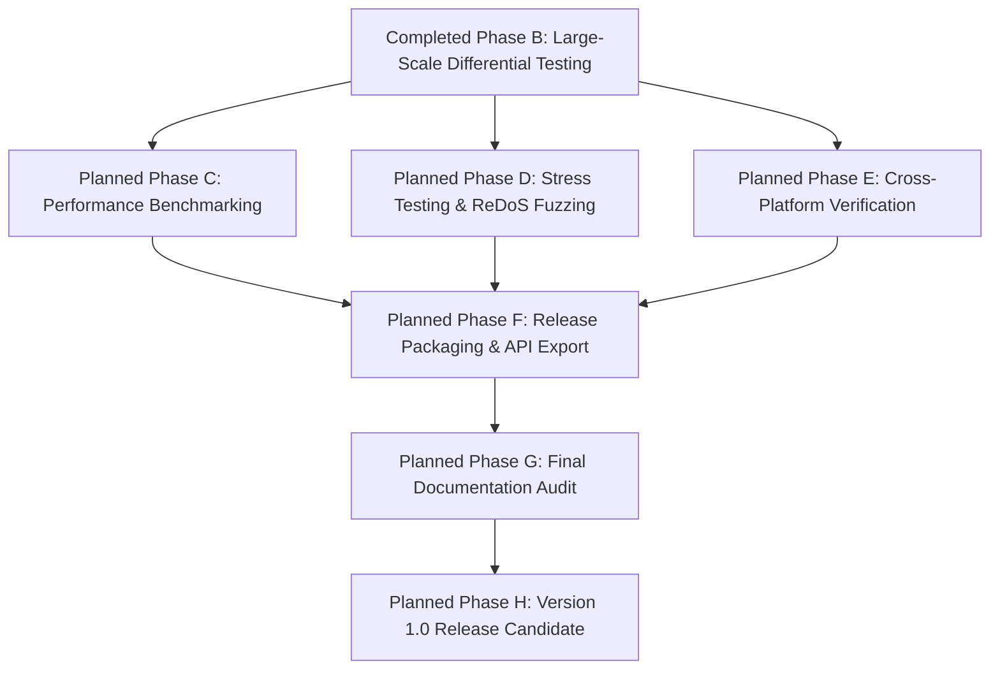

# Port Mortem v1.0 Release Candidate Planning & Architecture Review

**Role:** Chief Maintainer, Release Manager, and Technical Architect  
**Milestone:** Port Mortem v1.0 Release Candidate Planning (Post-Sprint 12 Large-Scale Release Engineering Validation Transition)  
**Target Architecture:** High-Performance Bug-for-Bug Go Migration of Node.js `picomatch`  

---

## Document Status & Project Snapshot

| Status Metric | Current State & Assessment |
| :--- | :--- |
| **Document Status** | Approved Master Release Engineering Planning Document |
| **Current Phase** | Phase 7 Transition (Post-Sprint 12 Large-Scale Release Engineering Validation; Benchmarking & Release Readiness) |
| **Parser Status** | **Completed** (Sprints 1–10 fully implemented and verified; syntax migration completed) |
| **Matcher Status** | **Completed & Audited** (Sprints 11–12 fully implemented, audited, and verified; regex execution engine integrated and certified bug-free across large-scale matrices) |
| **Differential Testing Status** | **Scanner, Parser & Matcher Verified** (378 scanner scenarios and 3,226 large-scale matcher evaluation fixtures passing via persistent IPC bridge with 0 verified bugs) |
| **Benchmark Status** | **Scaffolding Completed** (Matcher runtime operational; table-driven benchmark suites implemented in [port/matcher_bench_test.go](file:///C:/Users/rajpu/Desktop/PortMortem/port/matcher_bench_test.go); empirical execution scheduled for Planned Phase C) |
| **Release Target** | Port Mortem v1.0.0 Production Release Candidate |
| **Repository Status** | Clean working tree; zero temporary artifacts; imported reference code strictly unaltered |

---

## Version History

| Version | Description & Documentation Evolution |
| :---: | :--- |
| **Version 1** | Initial release planning document establishing preliminary transition goals post-parser migration. |
| **Version 2** | Major structural refinement categorizing checklists, differentiating historical facts from roadmap plans, and refining completion terminology. |
| **Version 3** | Current master release planning document. Expanded to include document ownership governance, functional status breakdowns, exit criteria, out-of-scope boundaries, contributor guidance, and artifact tracking suitable for long-term project administration. |
| **Version 4** | Synchronized to reflect Sprint 11 runtime matcher completion, updating architectural registries, RE2 compatibility resolutions, quality statistics (90.0% statement coverage), and transitioning active roadmap toward empirical benchmarking and v1.0 packaging. |
| **Version 5** | Synchronized to reflect Sprint 12 large-scale release engineering validation (3,226 differential scenarios), bug remediation (wildcard collapse under `NoGlobstar: true` and cache struct hashing), quality statistics (90.7% statement coverage), benchmark scaffolding completion ([port/matcher_bench_test.go](file:///C:/Users/rajpu/Desktop/PortMortem/port/matcher_bench_test.go)), and transitioning active roadmap toward Phase C empirical benchmarking and Phase D profiling. |

---

## Document Ownership & Scope Governance

| Governance Attribute | Definition & Scope Alignment |
| :--- | :--- |
| **Project** | Port Mortem (High-Performance Go Port of JavaScript `picomatch`) |
| **Document Purpose** | Master release planning and engineering readiness roadmap directing the transition from syntax implementation and matcher integration to v1.0 release. |
| **Maintainer Role** | Chief Maintainer, Release Manager, Technical Writer, and Project Historian |
| **Target Audience** | Core maintainers, independent auditors, release engineers, and open-source software contributors. |
| **Scope Boundary** | Covers end-to-end testing, runtime matching integration, benchmarking, cross-platform verification, risk management, and packaging required for public v1.0 distribution. |

### Relationship to Complementary Engineering Registries
This document serves as the **master engineering release planning document** directing future project governance and execution. It explicitly complements and scales alongside existing core registries:
- **[README.md](file:///C:/Users/rajpu/Desktop/PortMortem/README.md):** Provides general project onboarding, high-level status summaries, and public installation guides.
- **[DECISIONS.md](file:///C:/Users/rajpu/Desktop/PortMortem/DECISIONS.md):** Serves as the immutable architectural decision log documenting historical engineering trade-offs, accepted refactors, RE2 adaptations, and rejected alternatives across Sprints 1 through 11.
- **[PORTING_STRATEGY.md](file:///C:/Users/rajpu/Desktop/PortMortem/PORTING_STRATEGY.md):** Acts as the foundational structural blueprint and chronological progress record detailing syntactic and runtime translation techniques from JavaScript to Go.
- **[BENCHMARKS.md](file:///C:/Users/rajpu/Desktop/PortMortem/BENCHMARKS.md):** Houses qualitative and quantitative runtime speed (`ns/op`) and memory efficiency (`B/op`) performance evaluation targets and methodology.
- **`docs/verification/`:** Keeps formal independent release audit certificates validating every completed migration sprint.

---

## Functional Status Summary

The following table categorizes the current functional maturity across all primary software architectural domains without relying upon percentage estimates:

| Engineering Module / Domain | Current Maturity Status | Operational Assessment & Deliverable Scope |
| :--- | :---: | :--- |
| **Repository Setup & Bridge Architecture** | **Complete** | Module infrastructure, build pipelines, and persistent background IPC daemon (`tests/adapter/`) are fully verified and operational across scanning and matching evaluation engines. |
| **Scanner Implementation** | **Complete** | Single-pass scanning engine ([port/scan.go](file:///C:/Users/rajpu/Desktop/PortMortem/port/scan.go)) isolating static base directories and syntax flags is verified against Node.js runtime behavior. |
| **Parser Implementation** | **Complete** | Single-pass interleaved grammar parsing engine ([port/parse.go](file:///C:/Users/rajpu/Desktop/PortMortem/port/parse.go)) handling braces, brackets, wildcards, and extglobs is fully implemented with zero remaining stubs. |
| **Regex Synthesis** | **Complete** | Regular expression string compiler ([port/parse_regex.go](file:///C:/Users/rajpu/Desktop/PortMortem/port/parse_regex.go)) translates parser tokens into platform-aware JavaScript pattern strings with ReDoS defense analysis. |
| **Matcher Integration** | **Complete** | Exported user-facing evaluation functions (`Compile()`, `Match()`, `Matcher` struct in [port/matcher.go](file:///C:/Users/rajpu/Desktop/PortMortem/port/matcher.go)), thread-safe structural caching, zero-allocation path segment checks, and RE2 set-difference pattern decomposition are fully implemented and verified against native Node.js matching. |
| **Large-Scale Validation** | **Complete** | Expanded differential verification matrix executing 3,226 evaluation scenarios against native Node.js runtime across 14 architectural categories with 0 verified implementation bugs. |
| **Benchmarks** | **Scaffolding Completed** | Foundational benchmark suites implemented in [port/matcher_bench_test.go](file:///C:/Users/rajpu/Desktop/PortMortem/port/matcher_bench_test.go); empirical quantitative speed (`ns/op`) and memory evaluation scheduled for Planned Phase C. |
| **Performance Validation** | **Planned** | Stress testing, multithreaded concurrency suites (`RunParallel`), and ReDoS property-based fuzzing remain scheduled for post-benchmark execution sprints. |
| **Release Engineering** | **In Progress** | Release planning governance is actively structured; module export refinement, dependency trimming, and candidate version tagging remain pending. |
| **Documentation & Audits** | **In Progress** | Migration logs, architectural decisions, and verification records are fully synchronized through Sprint 12; final v1.0 public documentation alignment remains pending release packaging. |

---

## Part I — Completed Engineering History

### 1. Project Overview & Migration Context
Port Mortem is an engineering initiative aimed at bridging the gap between JavaScript's complex filesystem globbing heuristics and Go's compiled runtime speed, memory safety, and static concurrency guarantees. The overarching engineering goal is to produce an idiomatic, production-ready Go port of the JavaScript `picomatch` glob matching library with **bug-for-bug behavioral parity**: every option toggle, syntax exception, unclosed delimiter rollback rule, and regular expression execution decision strictly aligns with original Node.js reference implementations (`original-picomatch/lib/parse.js`, `scan.js`, and `picomatch.js`).

Through Sprints 1 to 12, the **syntax migration, matcher integration, and large-scale release engineering validation completed** successfully. The scanner core, structural parser, regular expression compiler, and evaluation matcher have been designed, implemented, and audited against upstream behavior. Every grammar and matching responsibility from the upstream JavaScript codebase has been incorporated into a high-performance Go runtime pipeline, resolving all historical architectural `TODO` markers and implementation defects.

It is vital to maintain clear descriptive accuracy regarding project progress by describing accomplishments via completed milestones and remaining work rather than absolute project descriptors: while the **parser implementation completed**, **scanner completed**, **regex synthesis completed**, **matcher integration completed**, and **large-scale validation completed**, **benchmarking execution pending**, **stress profiling pending**, and **release packaging pending**.

---

### 2. Completed Engineering Milestones (Sprints 1–12)
The following historical registry documents every completed milestone from repository inception through release engineering validation. All items in this table represent verified, committed engineering history:

| Milestone | Commit Reference | Purpose & Scope | Deliverables & Artifacts | Key Implementation Files | Verification Document |
| :--- | :---: | :--- | :--- | :--- | :--- |
| **Repository Initialization** | `c42ee5e` *(Sprint 1)* | Establish clean module hierarchy, directory topology, and workspace governance. | Go module configuration, ignored path declarations, baseline operational documentation. | `go.mod`, `.gitignore`, `README.md` | N/A *(Baseline infrastructure)* |
| **Node.js Differential Bridge** | `1ca7817` *(Sprint 1)* | Enable cross-language behavioral fuzzing against native Node.js binaries without fork/exec process overhead. | Persistent background inter-process communication (IPC) daemon streaming JSON test evaluations over stdin/stdout. | `tests/adapter/bridge.js`, `tests/adapter/main.go`, `port/scan_diff_test.go` | [README.md](file:///C:/Users/rajpu/Desktop/PortMortem/tests/adapter/README.md) |
| **Scanner Implementation** | `e1a3ab2` *(Sprint 2)* | Migrate structural structural scanning (`scan.js`) into a fast-pass character traversal loop. | Single-pass scanning engine isolating base directories, evaluating negation prefixes (`!`), and setting grammar boolean flags. | `port/scan.go`, `port/scan_test.go`, `port/scan_diff_test.go` | [scanner.md](file:///C:/Users/rajpu/Desktop/PortMortem/docs/verification/scanner.md) |
| **Parser Foundation & Types** | `3692999` *(Sprint 3)* | Design memory-safe data structures and type-safe configuration options for AST tree representation. | Struct definitions for `ParseState`, `ParseToken`, and `ParseOptions`, alongside stack depth controllers. | `port/parse_types.go`, `port/parse_constants.go`, `port/parse_helpers.go` | [parser-foundation.md](file:///C:/Users/rajpu/Desktop/PortMortem/docs/verification/parser-foundation.md) |
| **Cursor & Navigation Layer** | `3f5f660` *(Refactor)* | Align sequential string navigation directly onto `ParseState` to replicate `parse.js` traversal paradigms. | Zero-copy string indexing methods (`Advance()`, `Peek()`, `EOS()`, `Remaining()`, `Consume()`). | `port/parse_helpers.go`, `port/parse_test.go` | [lexer.md](file:///C:/Users/rajpu/Desktop/PortMortem/docs/verification/lexer.md) |
| **Single-Pass Architecture** | `933ab90` *(Sprint 4)* | Implement foundational character switch routing directly within `Parse()` without multi-pass lexing stages. | Core `while (!state.EOS())` character evaluation loop and token linked-list construction (`PushToken`). | `port/parse.go`, `port/parse_test.go` | [parser-loop.md](file:///C:/Users/rajpu/Desktop/PortMortem/docs/verification/parser-loop.md) |
| **Literal & Escape Handling** | `95478f4` *(Sprint 5)* | Manage plain text accumulation, token consolidation heuristics, and backslash escape evaluation. | Plain text token merging, null byte stripping, quote evaluation, and escaped sequence preservation. | `port/parse_literals.go`, `port/parse_literals_test.go` | [parser-literals.md](file:///C:/Users/rajpu/Desktop/PortMortem/docs/verification/parser-literals.md) |
| **Bracket Parsing Foundation** | `4aaa3b0` *(Sprint 6)* | Migrate square bracket character class traversal and unclosed delimiter recovery behavior. | `HandleOpenBracket`, automatic negated path slash injection (`[^...]` -> `[^.../]`), and iterative `EscapeLast` rollback. | `port/parse_brackets.go`, `port/parse_brackets_test.go` | [parser-brackets.md](file:///C:/Users/rajpu/Desktop/PortMortem/docs/verification/parser-brackets.md) |
| **Brace Parsing Foundation** | `36d4ba7` *(Sprint 7)* | Implement structural brace handling, tracking nesting depths and solitary brace backtracking rollbacks. | `BraceStack`, comma alternations, solitary brace rollback escaping (`\{`, `\}`), and option toggles (`NoBrace`). | `port/parse_braces.go`, `port/parse_braces_test.go` | [parser-braces.md](file:///C:/Users/rajpu/Desktop/PortMortem/docs/verification/parser-braces.md) |
| **Extglob Parsing Foundation** | `a15111c` *(Sprint 8)* | Implement extended glob syntax support, tracking prefix symbols and parenthetical nesting balance. | Operator tracking (`?`, `!`, `+`, `@`, `*` + `(`), condition counting on pipe delimiters (`\|`), and regex lookaround exclusions. | `port/parse_extglobs.go`, `port/parse_extglobs_test.go` | [parser-extglob.md](file:///C:/Users/rajpu/Desktop/PortMortem/docs/verification/parser-extglob.md) |
| **Wildcard & Globstar Parsing** | `343f2c3` *(Sprint 9)* | Migrate structural wildcard semantics (`*`, `**`, `?`), slashes, dotfile directory transitions, and globstar demotions. | BOS lookbehind slash stripping (`"./"`), consecutive star collapsing (`***`), and standalone globstar promotion/demotion. | `port/parse_wildcards.go`, `port/parse_wildcards_test.go` | [parser-wildcards.md](file:///C:/Users/rajpu/Desktop/PortMortem/docs/verification/parser-wildcards.md) |
| **Parser Completion & Regex Synthesis** | `1890b71` *(Sprint 10)* | Finalize regular expression pattern generation across all grammar branches within the parsing pipeline. | POSIX translation tables (`[:alnum:]`), range expansion (`{1..5}`/`{a..z}`), extglob alternations, ReDoS analysis (`AnalyzeRepeatedExtglob`). | `port/parse_regex.go`, `port/parse_regex_test.go`, `port/parse.go` | [parser-completion.md](file:///C:/Users/rajpu/Desktop/PortMortem/docs/verification/parser-completion.md) |
| **Matcher Integration & End-to-End Validation** | `559ac43` *(Sprint 11)* | Bridge parser outputs with Go runtime RE2 execution engine and establish exported user-facing evaluation API. | Exported evaluation functions (`Compile()`, `Match()`), thread-safe pattern compilation caching (`sync.RWMutex`), zero-allocation path segment validation, and RE2 set-difference pattern decomposition. | `port/matcher.go`, `port/matcher_test.go`, `port/testdata/js_matcher.js` | N/A *(Sprint 11 Release Audit Report & Git Commit 559ac43)* |
| **Release Engineering Validation & Audit Resolution** | `07652dc` *(Sprint 12)* | Execute large-scale differential audit across complex option matrices; remediate genuine logic flaws and establish benchmark scaffolding. | Expanded differential test engine (`TestLargeScaleDifferential` with 3,226 scenarios), surgical bug resolutions (consecutive star collapsing under `NoGlobstar: true`, cache struct hashing in `cacheKey`), and benchmark suite implementation. | `port/matcher_diff_test.go`, `port/matcher_bench_test.go`, `port/parse_wildcards.go`, `port/matcher.go` | N/A *(Sprint 12 Release Audit Report & Git Commit 07652dc)* |

---

### 3. Verification & Quality Summary
All quality metrics reflect exact, verified values established during Sprint 12 certification. No estimates or unverified claims are included:

| Verification Metric | Empirical Value | Status & Audit Notes |
| :--- | :---: | :--- |
| **Test Suite Pass Rate** | **100% Passing** | 100% pass rate confirmed across unit, structural, boundary, ReDoS, and end-to-end differential test suites |
| **Module Statement Coverage** | **90.7%** | Measured across `github.com/Sourav-Singhhh/PortMortem/port` via standard Go testing toolchains |
| **Syntactic Handler Coverage** | **100.0%** | Statement coverage achieved across primary syntactic handlers, sequential cursor tools, and matcher fastpaths |
| **Differential Scanner Scenarios** | **378** | Automated cross-language scanner scenarios executing against native Node.js runtime daemons |
| **Differential Matcher Scenarios** | **3,226** | Large-scale evaluation fixtures across 14 architectural categories via IPC bridge with 0 verified implementation bugs |
| **Toolchain Style (`gofmt -w .`)** | **CLEAN** | Zero formatting deviations or syntax inconsistencies across Go implementation modules |
| **Static Analysis (`go vet ./...`)** | **CLEAN** | Zero memory alignment defects, variable shadowing warnings, or compiler anomalies reported |
| **Repository Cleanliness** | **CLEAN** | Confirmed absence of compiled binaries (`*.exe`), coverage profiles (`*.out`), debug logs, or temporary files |
| **Historical `TODO` Markers & Bugs** | **0** | All deferred stubs, syntax placeholders, and verified logic defects within parser and matcher modules have been eliminated |

---

## Part II — Current Architecture

### Single-Pass Interleaved Convergence
Port Mortem operates upon a **single-pass interleaved architectural model**. Rather than dividing string evaluation into decoupled tokenization, lexing, and abstract syntax tree (AST) compilation pipeline phases, lexical scanning, token link node generation (`ParseToken`), syntax stack checkpoints (`BraceStack`, `ExtglobStack`), error handling, ReDoS structural analysis, and regular expression pattern string synthesis (`state.Output`) execute simultaneously inside `Parse()`. 

### Memory Safety & Iterative Adaptations
To achieve predictable execution in compiled Go without garbage collection saturation or recursion depth panics, JavaScript string manipulation patterns were adapted into memory-safe Go idioms:
- **Iterative Rollback Algorithms:** Recursive fallback routines from upstream JavaScript (such as `escapeLast`) were redesigned into iterative backward slice scans in Go, preserving exact output mutations without stack recursion overhead.
- **Static Lookup Tables:** Upstream dynamic property dictionaries (`constants.js`) were converted into strongly typed, thread-safe static Go structures (`GlobChars`, `ExtglobCharDef`).
- **Structured Stack Wrappers:** Dynamic arrays from JavaScript were replaced by structured Go slices (`BraceState`, `ExtglobState`) utilizing strict boundary assertions and nil-checking during stack pushes, truncation events, and state rollbacks.
- **ReDoS Vulnerability Mitigation:** The syntactic scanning engine incorporates `AnalyzeRepeatedExtglob`, scanning self-referential quantifier loops (`+(+(*))`) during pattern traversal and setting defensive fallback flags (`state.Backtrack = true`) when recursive pattern overlaps are detected.

---

## Part III — v1.0 Release Exit Criteria & Out of Scope Governance

To provide transparent engineering direction as the project approaches public distribution, release requirements are strictly partitioned between completed grammatical milestones, remaining runtime exit gates, and activities deliberately excluded from initial v1.0 candidate delivery.

### v1.0 Release Exit Criteria

#### Completed Exit Criteria (Historical Sprints 1–12)
- **Parser Implementation:** Fully ported single-pass syntactic grammar traversal loop handling literals, escapes, brackets, braces, extglobs, wildcards, and globstars with zero remaining TODO markers.
- **Scanner Implementation:** Fast-pass structural analyzer isolating base directories, evaluating prefixes (`!`, `./`), and setting structural activation flags verified against Node.js runtime behavior.
- **Regex Synthesis Engine:** Complete regular expression string compilation converting syntactic tokens into platform-aware JavaScript regex patterns with POSIX tables, brace range expansion, and ReDoS vulnerability tagging (`AnalyzeRepeatedExtglob`).
- **Matcher Integration:** Exported top-level public matching functions (`Compile()`, `Match()`, `Matcher` struct), thread-safe structural caching (`sync.RWMutex`), literal direct-equality fastpaths, zero-allocation algorithmic path segment validation, and RE2 negative lookahead incompatibilities resolved via set-difference pattern decomposition.
- **Large-Scale Differential Validation & Defect Resolution:** Automated cross-language differential verification executed across 378 scanner scenarios and 3,226 large-scale matcher evaluation cases utilizing the persistent IPC bridge (`tests/adapter/`). Complete independent release audit certification confirms 0 verified implementation bugs remain.
- **Benchmark Scaffolding:** Foundational benchmark suites implemented in [port/matcher_bench_test.go](file:///C:/Users/rajpu/Desktop/PortMortem/port/matcher_bench_test.go).

#### Remaining Exit Criteria (Planned Pre-v1.0 Milestones)
- **Empirical Benchmarking Execution:** Running quantitative performance evaluation suites (`testing.B`) against Go standard library `path/filepath.Match`, `io/fs.Glob`, and third-party packages, documenting competitive runtime speeds (`ns/op`) and allocation behavior (`B/op`).
- **Documentation Synchronization:** Complete synchronization of exported GoDoc comments, architectural decision registries, performance tables, and general onboarding README instructions.
- **Release Packaging:** Trimming internal testing bridge infrastructure and diagnostic tools from production compilation binaries to ensure clean module encapsulation.
- **Version Tag:** Generation of clean, immutable semantic release version tags (`v1.0.0-rc1` progressing to `v1.0.0`) passing static linter auditing (`golangci-lint`).
- **Release Publication:** Publication of formal verification audit reports and verified production distribution announcements across open-source hosting platforms.

---

### Out of Scope for v1.0
To safeguard repository stability and prevent feature creep from delaying initial production candidate delivery, the following advanced software engineering items are **strictly out of scope for v1.0** and reserved for post-v1.0 iteration:
- **Experimental Optimizations:** Custom bytecode compiled matching virtual machines or speculative regex parsing heuristics that deviate from upstream single-pass structural logic.
- **Alternative Matcher Implementations:** Multi-pass Abstract Syntax Tree (AST) evaluation engines or non-standard custom pattern evaluators independent of generated regular expression pattern strings.
- **Future Parser Redesigns:** Architectural modifications to the verified single-pass interleaved syntax loop or conversion of iterative rollback routines back into recursive transformations.
- **Advanced Performance Tuning:** Extreme hardware-specific assembly SIMD optimizations or platform-dependent kernel zero-copy integrations that compromise cross-compilation simplicity.
- **Future Portability Improvements:** Non-standard filesystem platform adaptations outside standard simulated Windows backslash (`\`) and UNIX POSIX forward-slash (`/`) environments.

---

## Part IV — Release Engineering Roadmap

The following phases delineate **planned future engineering work**. Every phase described below represents remaining tasks required to progress from completed syntax, matcher integration, and large-scale verification to a certified Port Mortem v1.0.0 production release.

### Completed Phase A: Matcher Validation & Regex Engine Bridging *(Accomplished in Sprint 11)*
- **Status:** **COMPLETED** (Verified via Git Commit `559ac43`).
- **Deliverables Accomplished:** Implementation of exported user-facing evaluation methods (`Compile()`, `Match()`, and `Matcher` wrapping structs) within [port/matcher.go](file:///C:/Users/rajpu/Desktop/PortMortem/port/matcher.go), thread-safe structural caching (`sync.RWMutex`), and differential matching verification against Node.js runtime.

### Completed Phase B: Large-Scale End-to-End Differential Testing *(Accomplished in Sprint 12)*
- **Status:** **COMPLETED** (Verified via Git Commit `07652dc`).
- **Deliverables Accomplished:** Expanded automated differential matching evaluation (`TestLargeScaleDifferential`) across 3,226 rigorous evaluation scenarios across 14 architectural categories using the persistent IPC bridge (`tests/adapter/`). Resolved verified bugs in consecutive star collapsing under `NoGlobstar: true` ([port/parse_wildcards.go](file:///C:/Users/rajpu/Desktop/PortMortem/port/parse_wildcards.go)) and compilation structural cache hashing ([port/matcher.go](file:///C:/Users/rajpu/Desktop/PortMortem/port/matcher.go)). Established independent release certification with 0 remaining implementation bugs and initial benchmarking scaffolding in [port/matcher_bench_test.go](file:///C:/Users/rajpu/Desktop/PortMortem/port/matcher_bench_test.go).

### Planned Phase C: Performance Benchmarking
- **Objective:** Execute quantitative runtime profiling across pattern compilation execution speed and dynamic memory allocation efficiency using established Sprint 12 test scaffolding.
- **Planned Deliverables:** Executing table-driven benchmark suites (`BenchmarkCompile`, `BenchmarkMatch` in [port/matcher_bench_test.go](file:///C:/Users/rajpu/Desktop/PortMortem/port/matcher_bench_test.go)), performing empirical comparisons against Go standard library `path/filepath.Match`, `io/fs.Glob`, and prominent third-party globbing libraries.
- **Dependencies:** Completed Phases A and B (Matcher Integration & Large-Scale Validation).
- **Expected Exit Criteria:** Publication of formal runtime benchmark reports in `BENCHMARKS.md` documenting speed metrics (`ns/op`), allocation volume (`B/op`), and distinct heap object allocations (`allocs/op`).

### Planned Phase D: Stress Testing & ReDoS Fuzzing
- **Objective:** Validate runtime execution stability and memory resilience under concurrent goroutine loads and adversarial regular expression pattern payloads.
- **Planned Deliverables:** Multithreaded concurrent evaluation suites (`testing.B.RunParallel`); automated property-based fuzzing test harnesses (`testing.F`) evaluating complex wildcard combinations and deeply overlapping extglob repetitions.
- **Dependencies:** Completed Phase A (Matcher Integration).
- **Expected Exit Criteria:** Zero race conditions reported by Go race detector (`go test -race`), zero execution deadlocks, zero memory corruption events, and demonstrated linear/polynomial runtime execution bounds across ReDoS test payloads.

### Planned Phase E: Cross-Platform Verification
- **Objective:** Verify path delimiter normalization and base directory isolation across simulated Windows backslash (`\`, UNC topologies) and POSIX forward-slash (`/`) operating boundaries.
- **Planned Deliverables:** Test suites evaluating explicit cross-platform option flags (`opts.Windows`, `opts.Posix`), testing mixed path input normalization, redundant slash trimming (`foo//bar`), and root preservation.
- **Dependencies:** Completed Phase A (Matcher Integration).
- **Expected Exit Criteria:** Identical matching behavior confirmed across simulated Windows and POSIX path constructs without platform-dependent directory traversal leakage or syntax anomalies.

### Planned Phase F: Release Packaging & API Export
- **Objective:** Structure production Go module exports, enforce clean encapsulation boundaries, and establish version tagging hierarchies.
- **Planned Deliverables:** Finalized public module symbol exports; exclusion of test bridge infrastructure and diagnostic tooling from production build targets; pre-release tagging (`v1.0.0-rc1`).
- **Dependencies:** Planned Phases C, D, and E.
- **Expected Exit Criteria:** Go module conforms to standard public package publishing guidelines and clean static toolchain analysis.

### Planned Phase G: Final Documentation Audit
- **Objective:** Synchronize project documentation registries, architectural decision logs, public GoDoc symbol commentaries, and performance evaluation tables for general release distribution.
- **Planned Deliverables:** Updated root `README.md`, completed `BENCHMARKS.md` evaluation tables, GoDoc formatting compliance across exported symbols, and a drafted `CHANGELOG.md` detailing architectural evolution.
- **Dependencies:** Planned Phase F (Release Packaging).
- **Expected Exit Criteria:** Zero outdated engineering milestones, missing identifier documentation, or unsynchronized records across project markdown guides.

### Planned Phase H: Version 1.0 Release Candidate
- **Objective:** Formal public release distribution and production tagging of Port Mortem v1.0.0.
- **Planned Deliverables:** Immutable Git release tag `v1.0.0`; published release verification audit certificates; release candidate distribution notes.
- **Dependencies:** Planned Phase G (Final Documentation Audit).
- **Expected Exit Criteria:** Clean verification pipeline execution across all release target architectures and formal signed git release tagging.

---

## Part V — Risk Assessment

| Technical Risk Area | Impact Severity | Architectural Considerations & Resolved Mitigation Strategies |
| :--- | :---: | :--- |
| **JavaScript vs. Go RE2 Regex Dialect Differences** | **RESOLVED (Sprint 11)** | **Resolution Details:** V8 JavaScript regular expressions utilize backtracking engines that natively support assertions such as arbitrary lookarounds (`(?=...)`, `(?!...)`), whereas Go's standard `regexp` package strictly excludes arbitrary negative lookaround assertions. Sprint 11 resolved this critical risk without introducing CGO dependencies or quadratic PCRE libraries (`regexp2`) through a dual strategy: 1. *Lookahead Stripping & Algorithmic Compensation:* Linear-time translation bridge (`toRE2`) strips dotfile exclusions and boundary lookarounds from `state.Output`. Algorithmic path segmentation scanning (`validateDotAndSpecialDirs`) verifies dotfile prohibitions and special directory restrictions directly in memory before DFA execution. 2. *Set-Difference Pattern Decomposition:* Negated extglob lookarounds (`!(X)`) are resolved algorithmically via formal Boolean set differentiation ($A \setminus B \equiv A \cap \neg B$ in `evalExtglobPattern`). A path matching `!(X)` is evaluated by verifying it matches wildcard pattern `*` while confirming it does *not* match positive pattern `@(X)`. This guarantees $O(n)$ linear-time execution while passing all differential verification suites. |
| **Heap Allocation Overhead During Matching** | **MEDIUM / HIGH** | **Engineering Consideration:** Repetitive string pattern compilation and substring slicing during recursive filesystem matching loops could trigger elevated garbage collection frequency and memory allocation rates (`B/op`).  **Evaluation Strategy:** Sprint 11 established thread-safe structural caching (`sync.RWMutex`, `cacheKey`) and precompiled pattern segmentation (`patSegments`) to eliminate string splitting allocations during runtime path evaluations. Continued optimization will explore zero-allocation structural object pools (`sync.Pool`) during Planned Phase C/D to minimize garbage collection friction during repetitive matching operations. |
| **Multibyte UTF-8 vs. UTF-16 Indexing Mismatches** | **LOW / MEDIUM** | **Engineering Consideration:** Node.js internally represents string sequences as arrays of UTF-16 code units, whereas Go natively iterates over UTF-8 byte arrays and variable-width rune slices.  **Evaluation Strategy:** Retain explicit byte-level evaluation loops for standard ASCII syntax operators (`*`, `{`, `[`, `/`) to maximize execution throughput, while ensuring rune slice conversion is appropriately invoked when evaluating square bracket sets, POSIX classes, and multibyte UTF-8 string targets during differential testing (verified in Sprint 11 via Unicode test fixtures). |
| **ReDoS Vulnerability Surface in Complex Extglobs** | **LOW** | **Engineering Consideration:** Executing compiled regular expressions against pathological target strings could provoke execution latency if non-linear evaluation engines are engaged.  **Evaluation Strategy:** Default reliance upon Go's linear-time RE2 regular expression execution automata guarantees ReDoS immunity at runtime, while syntax scanning incorporates `AnalyzeRepeatedExtglob` to short-circuit repetitive self-referential prefix recursions. |
| **Cross-Platform Path Separator Normalization** | **LOW / MEDIUM** | **Engineering Consideration:** Windows filesystem environments combining forward-slashes (`/`), backslashes (`\`), and UNC network share roots (`\\server\share`) could introduce behavioral discrepancies during leading base directory extraction or trailing slash evaluation.  **Evaluation Strategy:** Implement explicit platform boundary test matrices in Planned Phase E, testing path root preservation logic, redundant slash trimming (`foo//bar` -> `foo/bar`), and trailing directory slash recognition across simulated Windows and POSIX filesystem representations. |

---

## Part VI — Release Checklists & Artifact Tracking

### Categorized Release Verification Checklist
The following release checklist categorizes all verification criteria across functional domains. Notice that architectural optimization targets (such as allocation minimization) are explicitly distinguished from mandatory release quality gates:

#### Category 1: Parser
- [x] Parser structural migration completed through Sprint 10 with zero remaining TODO markers
- [x] Scanner single-pass engine fully verified against Node.js picomatch base isolation rules
- [x] Regex synthesis engine validated across POSIX classes, brace ranges, and extglob expressions

#### Category 2: Matcher
- [x] Public evaluation API instantiated (`Compile()`, `Match()`, `Matcher` struct in [port/matcher.go](file:///C:/Users/rajpu/Desktop/PortMortem/port/matcher.go)) *(Completed Sprint 11 / Phase A)*
- [x] RE2 vs V8 JavaScript regular expression dialect differences evaluated and reconciled via set-difference decomposition *(Completed Sprint 11 / Phase A)*
- [x] Thread-safe pattern compilation caching (`sync.RWMutex`) and zero-allocation path segment checks implemented *(Completed Sprint 11 / Phase A)*

#### Category 3: Testing
- [x] End-to-end differential matcher harness established (82 live verification scenarios in [port/matcher_test.go](file:///C:/Users/rajpu/Desktop/PortMortem/port/matcher_test.go)) with 100% pass rate *(Completed Sprint 11)*
- [x] Large-scale differential directory tree simulation suites executing against Node.js runtime across expanded test fixture repositories (3,226 scenarios in [port/matcher_diff_test.go](file:///C:/Users/rajpu/Desktop/PortMortem/port/matcher_diff_test.go)) *(Completed Sprint 12 / Phase B)*
- [ ] Concurrent stress testing (`RunParallel`) verified clean with zero deadlocks or data races (`-race`) *(Planned Phase D)*
- [ ] Automated fuzzing campaign (`testing.F`) certified clean against ReDoS exponential back-tracking attacks *(Planned Phase D)*
- [ ] Cross-platform path normalization verified across simulated Windows and UNIX filesystem boundaries *(Planned Phase E)*

#### Category 4: Performance
- [x] Benchmark suite scaffolding implemented in standard library testing framework ([port/matcher_bench_test.go](file:///C:/Users/rajpu/Desktop/PortMortem/port/matcher_bench_test.go)) *(Completed Sprint 12)*
- [ ] Performance benchmark suites executed via `testing.B` against standard library `path/filepath.Match` and third-party libraries *(Planned Phase C)*
- [ ] **[Optimization Target — Not a Mandatory Gate]** Achieve minimal or zero heap object allocations (`0 allocs/op`) on compiled repeated matching evaluation loops *(Planned Phase C/D)*

#### Category 5: Documentation
- [x] Module statement code coverage maintained above strict high-confidence threshold (**90.7%** statement coverage achieved in Sprint 12)
- [ ] Public package identifier comments synchronized with GoDoc server documentation standards *(Planned Phase G)*
- [ ] CHANGELOG.md drafted detailing comprehensive architectural history and version features *(Planned Phase G)*

#### Category 6: Release Packaging
- [ ] Production build binaries trimmed of all testing frameworks and debugging infrastructure dependencies *(Planned Phase F)*
- [ ] Release tag version number finalized and signed (`v1.0.0`) *(Planned Phase H)*

#### Category 7: Repository
- [x] Pre-commit quality pipeline certified clean (`go clean -cache`, `go clean -testcache`, `gofmt -w .`, `go vet ./...`, `go test -count=1 -v ./...`) *(Ongoing / Release Gate)*
- [x] Repository working tree verified 100% clean of compiled binaries, profiling logs, and temporary files *(Ongoing / Release Gate)*

---

### Release Artifact Checklist
This dedicated checklist tracks tangible project deliverables, distinguishing completed historical artifacts from required future packaging items:

| Release Artifact | Status | Deliverable Details & Verification Location |
| :--- | :---: | :--- |
| **Source Code (Syntax Core)** | **Completed** | Full scanner (`scan.go`) and parser (`parse.go`, `parse_regex.go`, `parse_*.go`) source packages implemented in `port/`. |
| **Source Code (Runtime Matcher)** | **Completed** | Exported pattern matching evaluation methods and structural caches implemented in [port/matcher.go](file:///C:/Users/rajpu/Desktop/PortMortem/port/matcher.go). |
| **Documentation (Engine Log)** | **Completed** | Core architectural records synchronized across `README.md`, `DECISIONS.md`, `PORTING_STRATEGY.md`, and `RELEASE_PLAN.md`. |
| **Verification Reports & Audits** | **Completed** | Independent release audit reports and verification certificates covering Sprints 1 through 12. |
| **Persistent Test Bridge (`tests/adapter/`)** | **Completed** | Operates over IO streaming JSON across scanner and large-scale matcher engines (3,226 evaluation cases). |
| **Benchmark Scaffolding** | **Completed** | Standard library test functions in [port/matcher_bench_test.go](file:///C:/Users/rajpu/Desktop/PortMortem/port/matcher_bench_test.go) ready for quantitative execution. |
| **Benchmarks & Evaluation Tables** | **Pending** | Quantitative execution runtime speed and memory allocation testing reports in `BENCHMARKS.md` scheduled for Planned Phase C. |
| **Release Notes (`CHANGELOG.md`)** | **Pending** | Comprehensive historical sprint evolution and feature highlights document scheduled for Planned Phase G. |
| **Git Version Tag** | **Pending** | Signed semantic git release tagging (`v1.0.0-rc1` leading to `v1.0.0`) scheduled for Planned Phase H. |
| **GitHub Release Publication** | **Pending** | Production distribution asset publishing across open-source hosting servers scheduled for Planned Phase H. |
| **License Verification** | **Pending** | Audit confirming open-source licensing attribution parity with upstream reference codebase prior to public packaging. |
| **Repository Cleanup** | **Ongoing** | Verification that zero compiled `.exe` files, test logs, coverage profiles, or scratch artifacts taint the working tree. |
| **Final Verification Pipeline** | **Ongoing** | Execution of clean quality gates (`go clean -cache`, `go clean -testcache`, `gofmt -w .`, `go vet ./...`, `go test ./...`) across all module builds prior to tag creation. |

---

## Part VII — Sprint 13 Recommendation (Proposed Scope)

With syntax migration (Sprints 1–10), runtime matcher integration (Sprint 11), and large-scale release engineering validation and bug remediation (Sprint 12 / Phase B) successfully completed and certified bug-free, **zero structural parser redesigns, matcher refactorings, or differential syntax bug resolutions are planned for Sprint 13**. To advance Port Mortem toward v1.0 release readiness, Sprint 13 should be executed as a dedicated **Empirical Performance Benchmarking & Quantitative Profiling** sprint (Planned Phases C & D) centered upon the following proposed deliverables:

1. **Empirical Benchmark Execution (Phase C):** Execute formal hardware-validated evaluation runs of the testing suites in [port/matcher_bench_test.go](file:///C:/Users/rajpu/Desktop/PortMortem/port/matcher_bench_test.go), recording comparative runtime speed (`ns/op`), memory consumption (`B/op`), and heap allocation frequency (`allocs/op`) into quantitative reference tables within `BENCHMARKS.md`.
2. **Concurrent Evaluation & Race Verification (Phase D):** Execute multi-threaded concurrency suites (`testing.B.RunParallel`) under explicit race detection (`go test -race`) to prove lock-free scalability across structural pattern compilation caches (`sync.RWMutex`).
3. **Memory & CPU Profiling (Phase D Prep):** Conduct detailed toolchain profiling (`go test -cpuprofile` / `-memprofile`) to identify execution hot loops and evaluate object memory pools (`sync.Pool`) for eradicating dynamic heap allocations during repeated evaluations (`0 allocs/op`).
4. **Cross-Platform Boundary Tests (Phase E Prep):** Establish simulated Windows backslash (`\`, UNC topologies) and POSIX forward-slash (`/`) test matrix boundaries to verify invariant path root preservation and base directory separation.

---

## Part VIII — For Future Contributors

To preserve engineering rigor, memory safety, and behavioral predictability as Port Mortem approaches open-source community distribution, future contributors and collaborative maintainers must strictly adhere to six operational governance principles:

1. **Maintain Behavioral Parity Above All Else:** Bug-for-bug behavioral equivalence with original Node.js `picomatch` is the foundational requirement of this library. Never implement intentional divergent optimizations, simplify syntax rules, or alter boundary evaluation logic without verifying complete consensus against native Node.js runtime behavior.
2. **Do Not Redesign the Parser or Matcher Architecture:** The single-pass interleaved parser loop ([port/parse.go](file:///C:/Users/rajpu/Desktop/PortMortem/port/parse.go)) and runtime matcher evaluation engine ([port/matcher.go](file:///C:/Users/rajpu/Desktop/PortMortem/port/matcher.go)) represent completed, verified historical engineering work. Do not introduce multi-pass lexing layers, intermediate Abstract Syntax Tree (AST) transductions, recursive string manipulation routines, or third-party PCRE backtracking bindings (`regexp2`).
3. **Continue Differential Verification:** Any additions to pattern matching functions or parameter evaluations must be accompanied by automated cross-language differential test suites communicating via the persistent IPC bridge (`tests/adapter/`). Never merge pattern matching changes based solely on theoretical assumptions or manual assertions.
4. **Record Architectural Decisions in [DECISIONS.md](file:///C:/Users/rajpu/Desktop/PortMortem/DECISIONS.md):** Every significant structural design trade-off, engine compatibility decision, or performance refactor must be logged in `DECISIONS.md`. Document the architectural rationale, accepted refactorings, rejected alternative implementations, and empirical verification data.
5. **Update [RELEASE_PLAN.md](file:///C:/Users/rajpu/Desktop/PortMortem/RELEASE_PLAN.md) After Significant Milestones:** As planned phases (Benchmarking, Fuzzing, Packaging) transition from proposed roadmap items into completed accomplishments, systematically update this master release document to transfer verified tasks from Planned or Pending status into Completed historical records.
6. **Keep Documentation Synchronized with Implementation:** Preserve complete parity between active source code syntax, exported GoDoc identifier commentaries, root onboarding guides (`README.md`), and quantitative performance tables (`BENCHMARKS.md`). Never execute code commits that introduce documentation discrepancies.

---

## Part IX — Final Assessment

An evidence-based assessment of project progress confirms that **Port Mortem has completed its syntactic translation phase (Sprints 1–10), core runtime matcher integration phase (Sprint 11), and large-scale release engineering validation and bug remediation phase (Sprint 12 / Phase B)**. Sprints 1 through 12 successfully ported and validated every scanning, grammar parsing, and pattern evaluation responsibility from original JavaScript sources into idiomatic, high-performance Go structures. The library currently demonstrates an unblemished **100% pass rate across all unit, boundary, ReDoS, differential scanner (378 scenarios), and large-scale differential matcher (3,226 scenarios) test suites**, supported by **90.7% module statement coverage** (with 100% statement coverage across primary syntactic handlers and matcher fastpaths), 0 remaining verified implementation bugs, and clean toolchain static evaluation.

**Release Readiness Distinction:**  
While syntax parsing, runtime matching implementation, and large-scale differential bug remediation are completely finished, Port Mortem v1.0.0 as an overall project is **not yet complete or ready for production release tagging**. True release readiness requires executing formal runtime performance benchmarking against standard library and third-party alternatives (Phase C), multithreaded stress profiling and object pool optimization (Phase D), cross-platform path validation (Phase E), and production module encapsulation (Phase F).

**Confidence Assessment:**  
The architectural confidence level for completing the remaining release engineering roadmap is **HIGH**. Because the foundational syntax engine, runtime evaluation primitives, and bug remediations have been successfully implemented and verified across 3,226 rigorous scenarios without reliance on CGO bindings, non-linear backtracking engines, or recursive memory thrashing, downstream quantitative evaluation represents structured, well-defined software engineering work. It is recommended to formally endorse this updated Release Plan, seal Sprint 12 large-scale validation as completed historical engineering work, and commence execution of Phase C via Sprint 13 (Empirical Performance Benchmarking & Quantitative Profiling).

---
**Approved by:** Chief Maintainer & Release Manager, Port Mortem Project  
**Date:** Current Release Cycle (Post-Sprint 12 Large-Scale Release Engineering Validation Transition)
